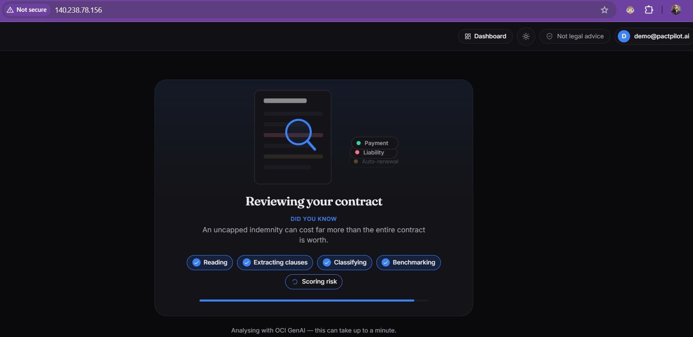
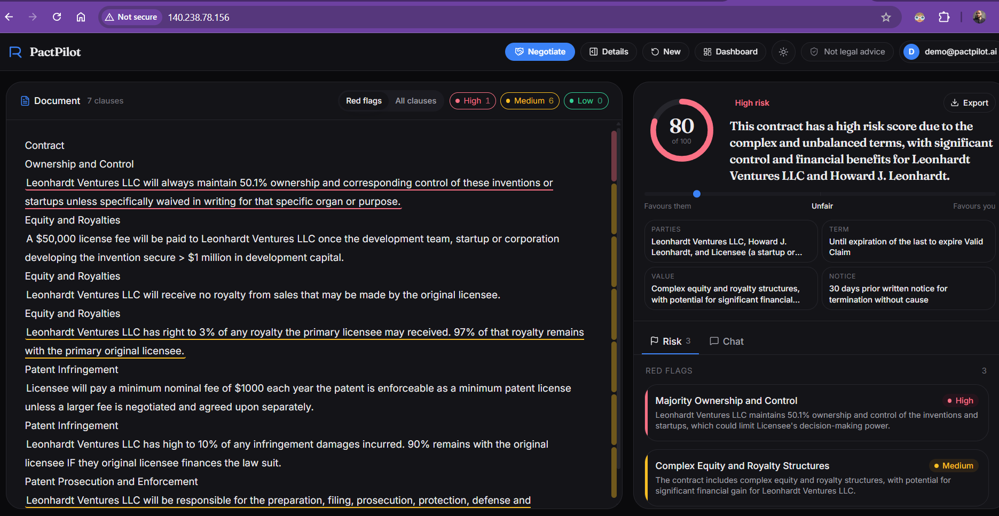
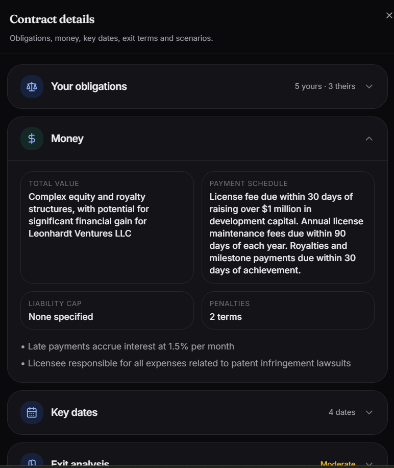
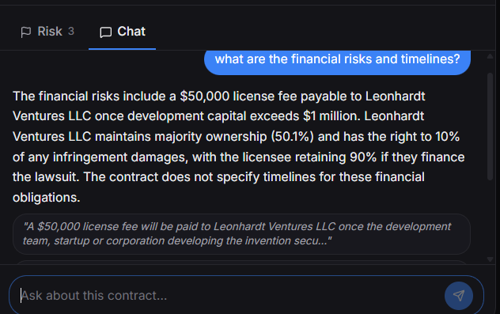
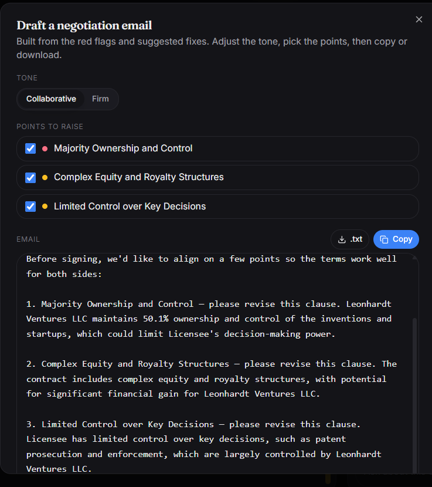
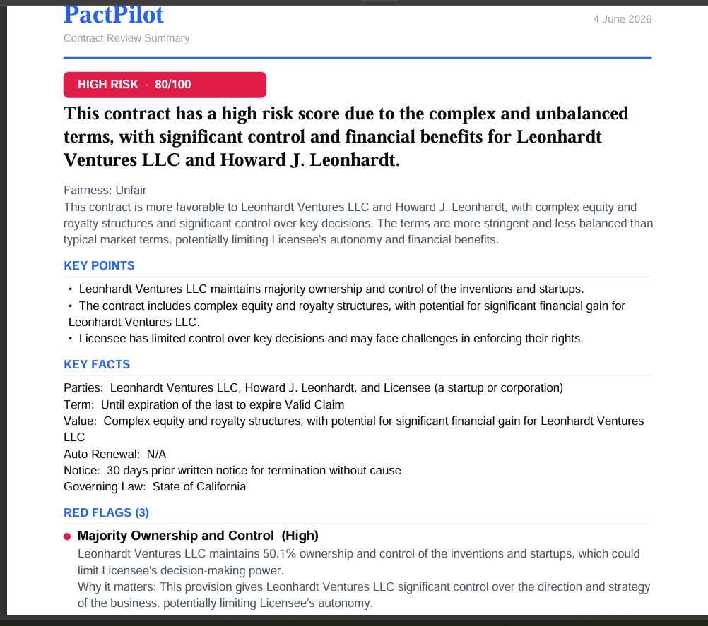
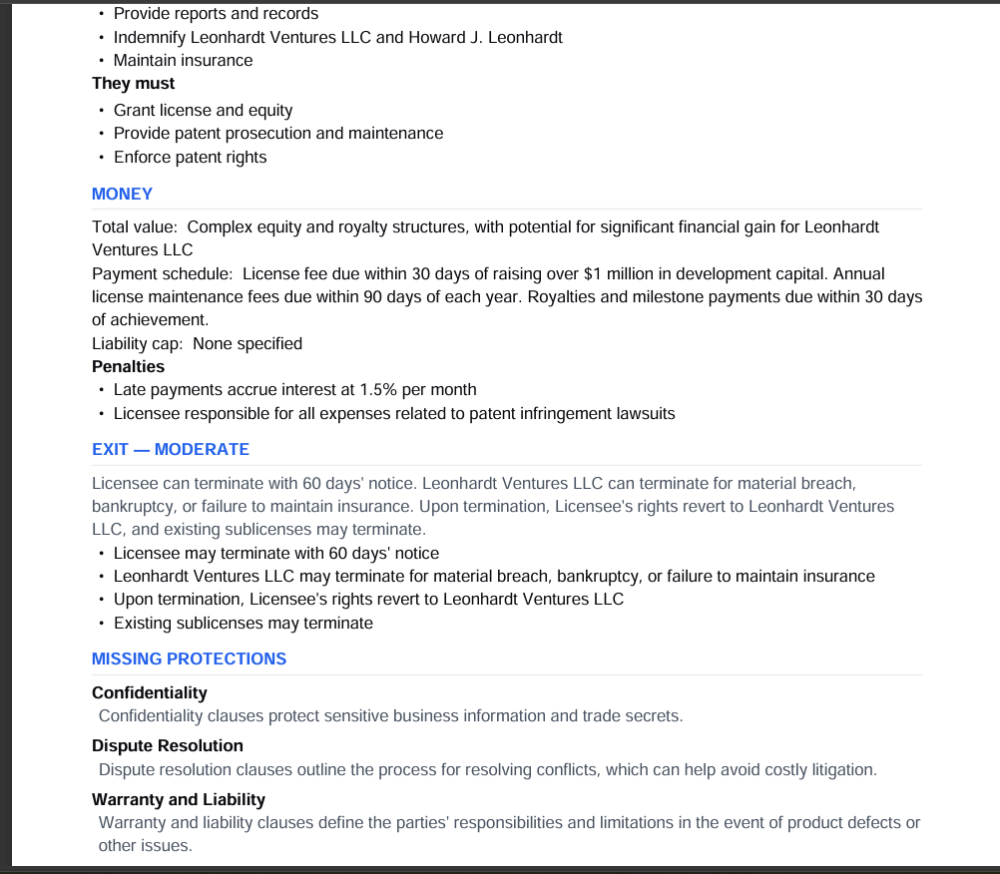
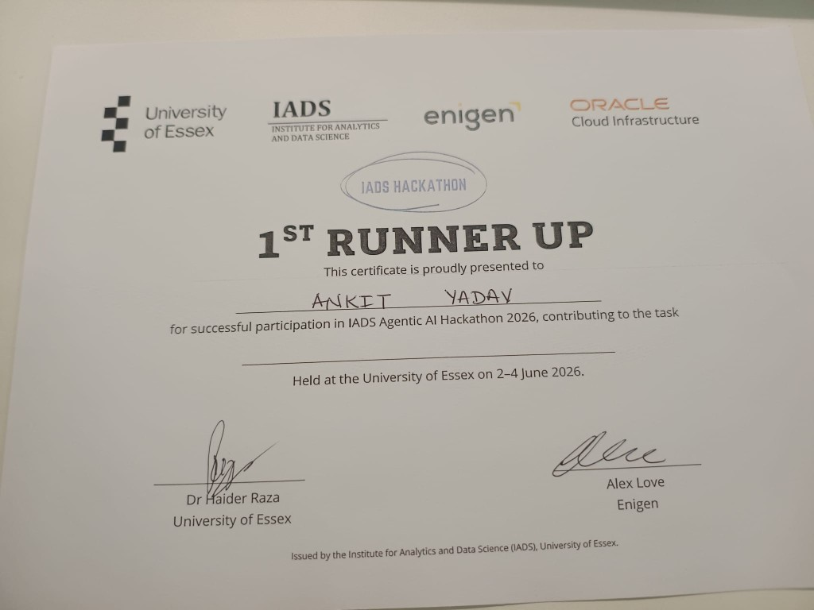

# PactPilot — AI Contract Review

> **IADS Agentic AI Hackathon 2026 · University of Essex · Challenge 1: Contract Review Agent**  
> **Team 6 — 1st Runner Up** (2–4 June 2026)

> Drop in a contract, get a lawyer's first look in ~30 seconds: a plain-English **risk verdict**, an
> interactive **risk-highlighted document**, market **benchmarks**, a grounded **Q&A chat**, and a
> one-click **negotiation email**. No account needed to analyse — sign in to save your history.

> 📖 For a complete, end-to-end catalogue of everything PactPilot does, see [`docs/FEATURES.md`](docs/FEATURES.md).  
> 📄 Pitch deck: [`docs/Hackathon-Team6-Demo-Ankit.pdf`](docs/Hackathon-Team6-Demo-Ankit.pdf)

Built for the **IADS Agentic AI Hackathon 2026** at the **University of Essex** (sponsored by
**Oracle Cloud Infrastructure** and **Enigen**). The entire deployed solution runs on **Oracle Cloud
Infrastructure (OCI)**: Generative AI for reasoning + embeddings, Autonomous DB 23ai for vector
search, and Compute for hosting.

> ⚠️ **Not legal advice.** PactPilot is a first-pass triage tool, not a lawyer.

---

## Live demo

**Try it:** http://140.238.78.156 · Demo login: `demo@pactpilot.ai` / `demo1234`

| Processing (~45s, OCI GenAI) | Risk cockpit + highlights |
|:---:|:---:|
|  |  |

| Contract details | Grounded Q&A chat | Negotiation email |
|:---:|:---:|:---:|
|  |  |  |

| Branded PDF export (summary) | Branded PDF export (depth panels) |
|:---:|:---:|
|  |  |

---

## Hackathon result

**1st Runner Up** — IADS Agentic AI Hackathon 2026, University of Essex (2–4 June 2026).



Team 6: Mykyta Yakivets · Ankit Yadav · Tarak Hossain · Luz Adriana Mendoza Alarcon · Claudia Yasmin Alarcon Gonzalez · Sukru Ahmet Gurbuz

---

## What it does

A small-business founder pastes or uploads a contract and immediately sees:

| Layer | What you get |
|---|---|
| **Verdict** | A 0–100 risk score, LOW/MEDIUM/HIGH level, a one-line summary, key facts, and a fairness meter (favours you ↔ favours them). |
| **Document cockpit** | The contract with each clause highlighted by risk; click a clause → plain-English meaning, why it's risky, a market benchmark, and a suggested fix. |
| **Red flags** | The genuinely dangerous clauses, ranked, each linked to its place in the document. |
| **Depth panels** | Obligations (yours vs theirs), money, key dates, exit difficulty, missing protections, and "what if" scenarios. |
| **Benchmarks** | Each clause is compared against a real corpus of market clauses (CUAD) via vector search — *"harsher than 78% of comparable clauses."* |
| **Q&A chat** | Ask anything about the contract; answers are grounded in the clauses (RAG) and cite them. |
| **Negotiation co-pilot** | Turn the red flags into a ready-to-send email — pick the points, choose a tone (collaborative / firm), copy & send. |
| **Export** | One click → a branded PDF summary. |
| **Accounts & dashboard** | Optional sign-in (email + password) saves each analysis to a history dashboard you can reopen later. |

Three built-in sample contracts span the risk spectrum so you can see it work instantly:
**dangerous** (a developer-drafted agency agreement), **suspicious** (a SaaS subscription with quiet
catches), and **legit** (a balanced mutual NDA).

---

## Architecture

```
  Founder ──▶  Frontend (React + TanStack Start, served from OCI)
                 │  REST  (frozen API contract: types.ts ⇆ schemas.py)
                 ▼
            Backend API  (FastAPI on OCI Compute)
                 │   own async orchestrator 
        ┌────────┼───────────────┬───────────────────┐
        ▼        ▼               ▼                   ▼
   OCI GenAI   Oracle 23ai     in-memory          (OCI Object
   chat +      AI Vector       result cache         Storage —
   embeddings  Search (or       (TTL)               planned)
   (Cohere)    in-mem cosine)
```

- **OCI Generative AI** = the required OCI AI service (LLM reasoning + embeddings), via the raw `oci` SDK.
- **Oracle Autonomous DB 23ai** AI Vector Search = the required vector DB (native `VECTOR` +
  `VECTOR_DISTANCE`). An in-memory cosine fallback keeps everything runnable with no DB.
- **FastAPI on OCI Compute** = the required *deployed* service. Frontend bundle is served from OCI too.

See [`docs/02-implementation-plan.md`](docs/02-implementation-plan.md) for the full picture.

---

## Tech stack

| | |
|---|---|
| **Frontend** | React 19 · TypeScript · Vite · TanStack Start (SSR) · Tailwind CSS v4 · shadcn/ui · lucide-react · jsPDF · light/dark theming |
| **Backend** | Python 3.11 · FastAPI · Pydantic · SQLAlchemy · **no LangChain / no LangGraph** |
| **AI** | OCI Generative AI via the raw `oci` SDK — chat `cohere.command-r-08-2024`, embeddings `cohere.embed-english-v3.0` |
| **Vector DB** | Oracle Autonomous DB 23ai native `VECTOR` (via `oracledb`) — or in-memory cosine fallback |
| **Accounts DB** | SQLite locally; Oracle ADB via the same `oracle+oracledb://` SQLAlchemy driver |
| **Auth** | bcrypt password hashing · HS256 JWT (PyJWT) |
| **Data** | CUAD legal corpus (`cuad_clauses.jsonl`) as the market-reference benchmark |
| **Docs parsing** | pdfplumber (PDF), python-docx (DOCX), **OCI Document AI OCR** (scanned PDF fallback) |

---

## Repo layout

```
README.md            ← you are here
CLAUDE.md            ← guide for coding agents + contributors (read first)
docs/                ← numbered planning + status docs (see index below)
frontend/            ← React/TanStack app (see frontend/README.md)
backend/             ← FastAPI app + OCI pipeline (see backend/README.md)
```

---

## Quick start

**Nothing on the cloud is required to run the app** — `FAKE_OCI=1` (backend) and an empty
`VITE_API_BASE_URL` (frontend) give you a fully working demo on canned/mock data.

### Prerequisites
- **Python 3.11** and **Node.js 18+** (npm).

### 1. Backend
```bash
cd backend
python -m venv .venv
.venv\Scripts\activate            # Windows  ·  macOS/Linux: source .venv/bin/activate
pip install -r requirements.txt
copy .env.example .env            # macOS/Linux: cp .env.example .env   (defaults to FAKE_OCI=1)
python -m uvicorn app.main:app --reload --port 8000
```
- API docs: http://localhost:8000/docs · health: http://localhost:8000/health

### 2. Frontend
```bash
cd frontend
npm install
npm run dev                       # open the URL it prints (http://localhost:8080)
```

### Modes
| Goal | Backend `.env` | `frontend/.env` |
|---|---|---|
| **UI only, no backend** | — | `VITE_API_BASE_URL=` (empty) → mock data |
| **Canned backend** (no cloud) | `FAKE_OCI=1` | `VITE_API_BASE_URL=http://localhost:8000` |
| **Real OCI pipeline** | `FAKE_OCI=0` + `OCI_*` filled | `VITE_API_BASE_URL=http://localhost:8000` |

For real mode you need OCI Generative AI access and `~/.oci/config` — see
[`docs/12-dev-onboarding-local-oci.md`](docs/12-dev-onboarding-local-oci.md) (step-by-step, Windows),
[`docs/08-oci-onboarding.md`](docs/08-oci-onboarding.md) (mental model), and
[`docs/06-oracle-setup.md`](docs/06-oracle-setup.md) (deploy).

---

## API at a glance

| Method | Path | Purpose |
|---|---|---|
| `GET` | `/api/samples` | The 3 built-in sample contracts |
| `POST` | `/api/analyze` | multipart form: `file` (PDF/DOCX) **or** `text` **or** `sample_id` → `AnalysisResult` |
| `GET` | `/api/analysis/{id}` | Re-fetch a result (cache → DB fallback for saved analyses) |
| `POST` | `/api/chat` | `{ analysis_id, message, clause_id? }` → `{ answer, citations[] }` |
| `POST` | `/api/auth/register` · `/api/auth/login` | Email + password → `{ token, user }` |
| `GET` | `/api/auth/me` | Current user (Bearer token) |
| `GET` · `POST` | `/api/analyses` | List / save the signed-in user's analyses |
| `GET` | `/health` | Liveness + whether `FAKE_OCI` is on |

The exact JSON shapes are the **frozen contract**: `frontend/src/lib/types.ts` ⇆
`backend/app/models/schemas.py`, mirrored in [`docs/03-api-contract.md`](docs/03-api-contract.md).
Never change a field without updating all three.

---

## Project status

- ✅ **Hackathon:** **1st Runner Up**, IADS Agentic AI Hackathon 2026 (University of Essex).
- ✅ **Working & verified:** FastAPI + real OCI GenAI analysis, RAG chat with citations, vector
  benchmarks (Oracle ADB 23ai on the deployed VM), accounts (JWT) + saved-history dashboard,
  sign-in-to-unlock teaser, client-side negotiation-email co-pilot, full redesigned UI (no-scroll
  cockpit, dark mode, animated processing, branded PDF export), **OCI Document AI OCR fallback**
  for scanned/poor-quality PDFs. **Live on OCI Compute:** http://140.238.78.156 — also runs offline
  (mock/canned) for local dev.
- 🟡 **Stretch / roadmap:** OCI Object Storage for ephemeral uploads, multi-agent pipeline
  (designed in [`docs/09-multi-agent-plan.md`](docs/09-multi-agent-plan.md)).

Honest notes: analysis is currently **one structured LLM call** (multi-agent is the next step), and
real-mode latency is ~30–45s.

---

## Documentation

| Doc | What |
|---|---|
| [`CLAUDE.md`](CLAUDE.md) | Agent/contributor guide — read first |
| [`docs/FEATURES.md`](docs/FEATURES.md) | **Full feature catalogue (everything the app does)** |
| [`docs/Hackathon-Team6-Demo-Ankit.pdf`](docs/Hackathon-Team6-Demo-Ankit.pdf) | Team 6 pitch deck (IADS 2026) |
| [`docs/01-project-brief.md`](docs/01-project-brief.md) | The idea, persona, scope |
| [`docs/02-implementation-plan.md`](docs/02-implementation-plan.md) | Architecture + how it fits together |
| [`docs/03-api-contract.md`](docs/03-api-contract.md) | **The frozen API contract** |
| [`docs/04-lovable-ui-prompt.md`](docs/04-lovable-ui-prompt.md) | UI build prompt + screen specs |
| [`docs/05-backend-plan.md`](docs/05-backend-plan.md) | Backend build plan |
| [`docs/06-oracle-setup.md`](docs/06-oracle-setup.md) | OCI account, region, ADB, deploy |
| [`docs/07-engineer-context.md`](docs/07-engineer-context.md) | Team split + who owns what |
| [`docs/08-oci-onboarding.md`](docs/08-oci-onboarding.md) | OCI mentoring guide (first-timers) |
| [`docs/09-multi-agent-plan.md`](docs/09-multi-agent-plan.md) | Plan to split analysis into agents |
| [`docs/STATUS.md`](docs/STATUS.md) · [`docs/IMPLEMENTATION-TRACKER.md`](docs/IMPLEMENTATION-TRACKER.md) | Live status + what's verified |

Frontend and backend each have their own README: [`frontend/README.md`](frontend/README.md) ·
[`backend/README.md`](backend/README.md).
