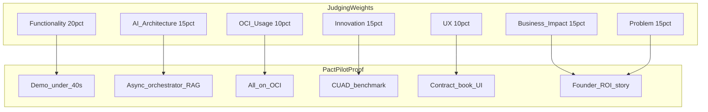
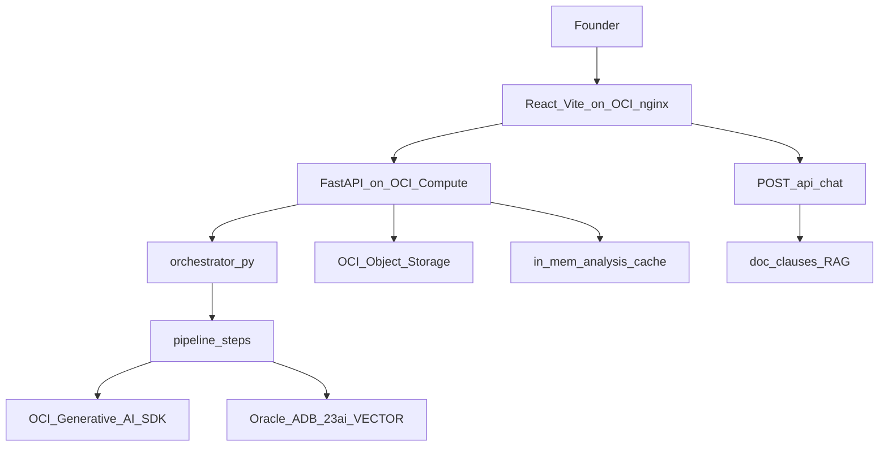

# PactPilot — Product Requirements Document (PRD)

> **Document zero.** Read this before [`01-project-brief.md`](01-project-brief.md).  
> **Status:** Approved for build (aligned with `main` @ CTO plan: FastAPI-only, OCI-first, contract-book UI).  
> **Tagline:** *Know what you're signing.*

| | |
|---|---|
| **Product** | PactPilot — AI contract-review agent (Topic 1) |
| **Event** | IADS Agentic AI Hackathon, University of Essex — 48 hours |
| **Team** | 6 people (see [§11 Team RACI](#11-team-raci)) |
| **Frozen contract** | [`03-api-contract.md`](03-api-contract.md) — do not change fields without cross-team ack |

**Canonical engineering docs:** [`01`](01-project-brief.md) idea · [`02`](02-implementation-plan.md) master plan · [`03`](03-api-contract.md) API · [`04`](04-lovable-ui-prompt.md) UI · [`05`](05-backend-plan.md) backend · [`06`](06-oracle-setup.md) OCI checklist · [`07`](07-engineer-context.md) pods · [`08`](08-oci-onboarding.md) OCI mentoring · [`09`](09-architecture-diagrams.md) diagrams · [`10`](10-mvp-execution-plan.md) 48h execution

---

## 1. Executive summary

PactPilot is a **stateless, no-login web app** for **small-business founders** who must sign contracts on short deadlines without affordable lawyer review. The user uploads a contract (PDF, DOCX, paste, or sample); in **~30 seconds** they receive:

1. **Layer 1 — Verdict:** risk score, summary, top red flags, fairness meter, key facts  
2. **Layer 2 — Document cockpit:** risk-highlighted contract, clause detail, market benchmarks, optional depth chapters, **grounded Q&A with citations**

The system is **agentic** (multi-step: read → segment → classify → retrieve → benchmark → score → extract → summarise → chat), not a single-shot chatbot. It **must** demonstrate RAG, **OCI Generative AI**, **Oracle 23ai vector search**, and a **fully OCI-hosted** deployed product.

**Not legal advice** — first-pass assist only.

---

## 2. Problem statement and positioning

### 2.1 Problem (judging: Problem Understanding — 15%)

- Businesses sign 10–80 page agreements (supplier, SaaS, NDA, lease) constantly.  
- Lawyers cost **£200–500/hr** and take days; small businesses often **sign blind**.  
- The failure mode is **missing one buried clause** (auto-renewal, unlimited liability, one-sided termination, penalties), not inability to read English.  
- Non-lawyers lack a **benchmark** for “normal” vs predatory terms.

### 2.2 Target user

**Small-business owner / founder** — cannot afford counsel, signs under deadline (e.g. “sign by Monday” vendor MSA).

### 2.3 Demo spine (rehearse this)

> Friday afternoon: 28-page SaaS MSA, sign by Monday. Founder uploads to PactPilot. **30 seconds later:** risk score 74/100; three red flags (auto-renew 3yr / 90-day notice, unlimited liability, 40% early-termination penalty); each with “what’s normal instead”; optional negotiation-email stretch. Judge path: upload sample → verdict → click Liability highlight → benchmark “harsher than 85%” → chat “can I cancel early?” → **cited** answer.

### 2.4 Hackathon mandatory capabilities (non-negotiable)

| # | Requirement | PactPilot implementation |
|---|-------------|---------------------------|
| 1 | RAG | `cuad_clauses` (benchmark) + `doc_clauses` (Q&A); retrieve before LLM |
| 2 | OCI AI services | OCI Generative AI — chat + embeddings via raw `oci` SDK |
| 3 | Vector database | Oracle Autonomous DB 23ai — native `VECTOR` + `VECTOR_DISTANCE` |
| 4 | Deployed app | FastAPI + static UI on **OCI Compute** (not a notebook) |

---

## 3. Judging criteria traceability

Essex marking rubric (1 = Poor … 5 = Excellent). **Target 4–5** on Functionality and Problem Understanding.

| Criterion | Weight | How we prove it | Primary owner | PRD refs |
|-----------|--------|-----------------|---------------|----------|
| **Problem Understanding** | 15% | Founder pain, blind-signing, Topic 1 alignment, killer scenario | Adriana | §2 |
| **AI Architecture** | 15% | Async orchestrator, dual vector tables, structured `llm_json` outputs, RAG | Mykyta | §5.6, §8 |
| **Functionality** | **20%** | End-to-end demo, &lt;40s analysis, cited chat, samples | All | §5, §12 |
| **OCI Usage** | 10% | GenAI + 23ai + Object Storage + Compute + **UI on OCI** | Mykyta | §7, NFR-007 |
| **Innovation** | 15% | CUAD percentile benchmarks, fairness meter, missing clauses | Adriana + Mykyta | §4, FR-030 |
| **User Experience** | 10% | Contract-book UI, verdict-first, collapsible chapters, a11y | Claudia | §9 |
| **Business Impact** | 15% | ROI vs lawyers, privacy, freemium wedge, competitor story | Adriana | §4 |

---

## 4. Business impact and innovation (Adriana)

*Adriana owns narrative, competitor framing, business model, and final presentation. Engineering does not block pitch on stretch features.*

### 4.1 Value proposition

- **“A lawyer’s first look in 30 seconds”** — decision support before expensive counsel.  
- Quantified pain: £200–500/hr, days of delay vs immediate structured output.

### 4.2 Business model (in scope for pitch only)

| Tier | Hackathon build | Pitch “what’s next” |
|------|-----------------|---------------------|
| Free anonymous review | **Yes** — no auth, stateless | Position as SaaS free tier |
| Paid / accounts / billing | **No** | Slide only |
| Browser extension / inbox guardian | **No** | Vision slide only |

### 4.3 Competitor framing (talk track)

| Alternative | Limitation | PactPilot edge |
|-------------|------------|----------------|
| Generic PDF summarisers | No clause-level risk or offsets | Segmented clauses + highlights |
| ChatGPT upload | No market benchmark, weak citations | CUAD RAG + `citations[]` on chat |
| Traditional lawyers | Cost, latency | Speed + triage (not replacement) |

### 4.4 Defensible innovation claims

- **Market benchmarking** — CUAD corpus, per-clause percentile (“harsher than X%”).  
- **Fairness meter** — contract leans toward you vs counterparty.  
- **Missing-clause detection** — protective clauses absent.  
- **Agentic pipeline** — concurrent analysis steps, not one prompt.  
- **Privacy GTM** — ephemeral file handling, no accounts.

### 4.5 Stretch pitch hooks (only if built)

- Suggested redlines · negotiation-email draft · PDF export — **Could have** in [`01-project-brief.md`](01-project-brief.md); do not promise in slides unless `AnalysisResult` contains them.

---

## 5. Functional requirements

Convention: **MUST** = MVP / judging failure if missing. **SHOULD** = differentiator. **MAY** = stretch.

Schema field names and shapes are defined only in [`03-api-contract.md`](03-api-contract.md).

### 5.1 Ingestion and samples

| ID | Requirement |
|----|-------------|
| FR-001 | System MUST accept PDF and DOCX via `POST /api/analyze` (`multipart/form-data`, field `file`). |
| FR-002 | System MUST accept pasted text (`{"text":"..."}`) and sample id (`{"sample_id":"..."}`). |
| FR-003 | System MUST expose `GET /api/samples` with at least three samples: `saas-msa`, `nda`, `supplier`. |
| FR-004 | System MUST return the standard error JSON for `UNSUPPORTED_FILE`, `FILE_TOO_LARGE`, `EMPTY_DOCUMENT`, `ANALYSIS_FAILED`, `NOT_FOUND`, `RATE_LIMITED`. |

### 5.2 Analysis — Layer 1 (guaranteed)

| ID | Requirement |
|----|-------------|
| FR-010 | Response MUST include `verdict.risk_score` (0–100 int), `verdict.risk_level` (`LOW`\|`MEDIUM`\|`HIGH`), `verdict.summary_line`, `verdict.summary_bullets` (~5). |
| FR-011 | Response MUST include `verdict.fairness` (`score` -1..1, `favors`, `label`). |
| FR-012 | Response MUST include `key_facts` (parties, term, value, auto_renewal, etc. per contract). |
| FR-013 | Response MUST include `red_flags[]` with `id`, `title`, `severity`, `clause_id`, `explanation`, `why_risky`. |
| FR-014 | `POST /api/analyze` MUST be **synchronous** (200 + full `AnalysisResult`); target **&lt; 40s** (demo **~30s**). |
| FR-015 | `GET /api/analysis/{analysis_id}` MUST return cached result or `404` if expired. |

### 5.3 Document cockpit — Layer 2 core (guaranteed)

| ID | Requirement |
|----|-------------|
| FR-020 | Response MUST include `document.html` (reflowed HTML) with `data-clause="<id>"` on clause elements. |
| FR-021 | Response MUST include `document.clauses[]` with `id`, `category`, `heading`, `text`, `risk_level`, `start`, `end`, `plain_english`, `why_risky`, `benchmark`, `suggested_fix`. |
| FR-022 | Clause `category` MUST use the enum in [`03-api-contract.md`](03-api-contract.md). |
| FR-023 | UI MUST keep **four selection sources in sync**: index list, document highlight, risk minimap, detail panel. |
| FR-024 | UI MUST sync red-flag clicks and chat citations to the same `clause_id` (scroll Document chapter). |
| FR-025 | UI MUST provide prev/next navigation across red flags. |

### 5.4 Depth panels (SHOULD — UI hides if absent)

| ID | Requirement |
|----|-------------|
| FR-030 | Backend SHOULD populate when ready: `obligations`, `money`, `dates`, `exit`, `scenarios`, `missing_clauses`, `benchmark_summary`. |
| FR-031 | UI MUST **hide entire collapsible chapters** when data is `null` or `[]` (not show empty shells). |
| FR-032 | UI SHOULD render depth content as **Chapters 03–08** per [`04-lovable-ui-prompt.md`](04-lovable-ui-prompt.md). |

### 5.5 Q&A (MUST — RAG)

| ID | Requirement |
|----|-------------|
| FR-040 | `POST /api/chat` MUST accept `analysis_id`, `message`, optional `clause_id`. |
| FR-041 | Response MUST include `answer` and `citations[]` with `clause_id` and `quote`. |
| FR-042 | Chat MUST retrieve from `doc_clauses` for the analysed contract before generating an answer. |

### 5.6 AI pipeline (MUST — Architecture + sponsor)

| ID | Requirement |
|----|-------------|
| FR-050 | All LLM and embedding calls MUST use **OCI Generative AI** (raw `oci` SDK) in production demo. |
| FR-051 | Benchmark step MUST query pre-built **`cuad_clauses`** (CUAD ingest). |
| FR-052 | Each analysis MUST embed uploaded clauses into **`doc_clauses`** for chat RAG. |
| FR-053 | Analysis MUST use **`orchestrator.py`** calling **`pipeline/steps/*`**; independent steps MAY run concurrently via `asyncio.gather`. |
| FR-054 | Each step MUST fill only its slice of `AnalysisResult` and be testable with a sample `clauses` list. |
| FR-055 | Structured LLM output MUST use `llm_json(prompt, schema)` → Pydantic (no LangChain). |
| FR-056 | Internal seam MUST remain `segment(text) -> list[Clause{id,heading,text,start,end}]`. |

### 5.7 Data handoff — Tarak → Mykyta

Gates vector ingest and demo quality. Tarak delivers; Mykyta (+ Sukru) consumes.

| Deliverable | Owner | Consumer | Definition of done |
|-------------|-------|----------|-------------------|
| CUAD subset (cleaned, license noted) | Tarak | Mykyta | Agreed size; English; usable clause segments |
| Three sample contracts (PDF/DOCX) | Tarak | Claudia, Mykyta | In `backend/data/samples/`; IDs match API samples |
| Demo **“villain”** contract | Tarak | Adriana, team | Contract that surfaces 3+ clear red flags for judging |
| `ingest_cuad.py` input spec (paths, metadata) | Tarak → Mykyta | Mykyta | Documented fields e.g. `category` |
| CUAD ingest run | Mykyta / Sukru | — | `cuad_clauses` populated on ADB 23ai (or `FAKE_OCI` fallback in dev) |
| Segmentation QA set (1–2 docs + expected boundaries) | Tarak | Mykyta | Validates `segment()` before analysis steps depend on it |
| Mock `AnalysisResult` JSON for UI | Tarak + Claudia | Claudia | Matches [`03-api-contract.md`](03-api-contract.md) exactly |

---

## 6. Non-functional requirements

| ID | Requirement |
|----|-------------|
| NFR-001 | **Stateless product:** no user accounts, no contract history DB. |
| NFR-002 | **Ephemeral uploads:** Object Storage delete after analysis; privacy message in UI. |
| NFR-003 | **Session cache:** in-memory `analysis_id` TTL ~1h; chat/analysis return `404` when expired. |
| NFR-004 | **Dev unblock:** `FAKE_OCI=1` stubs OCI; empty `VITE_API_BASE_URL` uses UI mocks. |
| NFR-005 | **Judged demo:** MUST run on **real** OCI GenAI + Oracle 23ai (not stubs). |
| NFR-006 | **Secrets:** no `.env`, wallet, or `~/.oci/config` in git. |
| NFR-007 | **OCI-first hosting:** entire deployed product on Oracle Cloud — API, GenAI, 23ai, Object Storage, **frontend static bundle**. |
| NFR-008 | **No third-party hosting:** MUST NOT use Vercel, Netlify, or Lovable hosting in production. |
| NFR-009 | **Recommended deploy:** nginx on same Ampere VM serves UI + proxies `/api/` to uvicorn (same origin). |
| NFR-010 | **No LangChain / LangGraph** in backend dependencies or architecture. |
| NFR-011 | **Accessibility:** collapsible `aria-expanded`, focus rings, 44px touch targets, contrast ≥4.5:1, `prefers-reduced-motion` for animations ([`04`](04-lovable-ui-prompt.md)). |
| NFR-012 | **Responsive:** no horizontal scroll at 375 / 768 / 1024 / 1440 px. |

---

## 7. Strict constraints (violating = out of spec)

1. **Frozen API** — Field names/shapes only change via [`03-api-contract.md`](03-api-contract.md) + `schemas.py` + UI types + PRD IDs, with UI and backend owners acked.  
2. **Layer 1 guaranteed** — `verdict`, `key_facts`, `red_flags`, `document.clauses` required for core UX.  
3. **Depth panels best-effort** — Core demo MUST NOT depend on `money` / `dates` / etc. being present.  
4. **Highlighting** — Reflowed `document.html` + char offsets; PDF pixel overlay is stretch only.  
5. **Synchronous analyse** — No polling-only MVP unless contract is formally amended.  
6. **Table names** — `cuad_clauses`, `doc_clauses` only.  
7. **OCI stack** — GenAI + ADB 23ai + Object Storage + Compute; sponsor narrative requires all four.  
8. **Home region** — GenAI-capable region at tenancy signup; **irreversible** ([`06`](06-oracle-setup.md), [`08`](08-oci-onboarding.md)).  
9. **Compartment** — All resources in `hackathon` compartment for teardown.  
10. **Legal copy** — “Not legal advice” on upload/results; no guarantee of legal outcomes.  
11. **48h discipline** — No new frameworks without Mykyta approval; simplest path that wins demo.  
12. **Lovable** — Builder only; export to `frontend/`; host on OCI.  
13. **Icons** — SVG only (e.g. Lucide); no emoji as icons in UI.

---

## 8. Out of scope (explicit)

The following are **Won’t have** for the hackathon build ([`01-project-brief.md`](01-project-brief.md)):

- User accounts, authentication, billing, payments  
- Contract portfolio, history, saved analyses  
- Word/page counts, reading time, readability scores, sentiment analysis, word clouds, topic tags  
- Replacing lawyers or providing guaranteed legal outcomes  
- Multi-contract diff / portfolio compare (post-hackathon only)  
- Async job queue / worker farm (unless API contract changes)  
- **LangChain, LangGraph, OracleVS, or any non-OCI cloud host for production**  
- Browser extension / proactive inbox guardian (pitch vision only)  
- PDF export, redlines, negotiation email (**unless** shipped as Could-have — do not commit in PRD as MUST)

---

## 9. User experience requirements (Claudia)

Full visual and interaction spec: **[`04-lovable-ui-prompt.md`](04-lovable-ui-prompt.md)**.

### 9.1 Design system (contract book)

| Token | Value / rule |
|-------|----------------|
| Background | `#FAF6EE` warm ivory |
| Cards | `#FFFFFF`, soft shadow |
| Text | `#0F172A` / muted `#475569` |
| Primary | Navy `#1E3A8A` |
| Accent | Gold `#B45309` (CTA, rules, wax seal) |
| Risk HIGH / MED / LOW | `#B91C1C` / `#B45309` / `#15803D` — always with label, not colour alone |
| Fonts | **EB Garamond** (headings, contract body); **Lato** (UI) |
| Mood | Bright, premium, editorial — **not** dark dashboard; no AI purple gradients |

### 9.2 Page states (single page)

1. **Upload** — drag-drop PDF/DOCX, paste toggle, sample chips, privacy footer  
2. **Processing** — SVG scanner line, ticking checklist, skeleton verdict  
3. **Results** — non-collapsible **verdict band** (gauge, wax seal, fairness SVG, key facts) + collapsible **Chapters 01–08** + docked chat  

### 9.3 Chapter map

| Chapter | Content | Default |
|---------|---------|---------|
| (band) | Verdict + key facts + optional `benchmark_summary` | Visible |
| 01 | Red flags | Open |
| 02 | Document cockpit (3-pane) | Open |
| 03 | Obligations | Collapsed if present |
| 04 | Money | Collapsed if present |
| 05 | Key dates timeline | Collapsed if present |
| 06 | Exit analysis | Collapsed if present |
| 07 | Missing clauses | Collapsed if present |
| 08 | What-if scenarios | Collapsed if present |

### 9.4 Integration

- Single module `api.ts`: `getSamples()`, `analyze()`, `getAnalysis()`, `chat()`  
- TypeScript types **mirror `AnalysisResult` exactly**  
- `VITE_API_BASE_URL` unset → mock + simulated delay; set → real API unchanged  

### 9.5 UI definition of done

- [ ] Mock mode: sample → processing animation → verdict band → chapters → flag click → benchmark in detail → mock chat citation scrolls to clause  
- [ ] `prefers-reduced-motion` respected  
- [ ] Real API: flip env only, no component rewrites  
- [ ] Production bundle served from **OCI** per [`06`](06-oracle-setup.md)

---

## 10. Technical architecture summary (Mykyta / Sukru)

| Layer | Technology | Doc |
|-------|------------|-----|
| Frontend | Lovable → `frontend/`, static build on OCI | [`04`](04-lovable-ui-prompt.md), [`06`](06-oracle-setup.md) |
| API | FastAPI, Pydantic schemas = API contract | [`05`](05-backend-plan.md) |
| Orchestration | `orchestrator.py` + `pipeline/steps/*`, `asyncio.gather` | [`05`](05-backend-plan.md) |
| LLM | `GenerativeAiInferenceClient`, `llm_json()` | [`05`](05-backend-plan.md), [`06`](06-oracle-setup.md) |
| Vectors | `oracledb` + `VECTOR_DISTANCE`; tables `cuad_clauses`, `doc_clauses` | [`05`](05-backend-plan.md) |
| Phase 0 | Canned `AnalysisResult` from hour 1 | [`05`](05-backend-plan.md) |

**Sukru (shadow):** bounded tasks under Mykyta — schema/helpers, step tests, ingest script assist, deploy checklist per [`08`](08-oci-onboarding.md).

**OCI learning path:** whole team reads [`08-oci-onboarding.md`](08-oci-onboarding.md); Mykyta mentors using [`06`](06-oracle-setup.md) checklist.

---

## 11. Team RACI

Maps **named team** to engineering pods in [`07-engineer-context.md`](07-engineer-context.md) (6-person model: 2 strong · 2 intermediate · 2 non-tech).

| Area | Accountable | Responsible | Consulted | Informed |
|------|-------------|-------------|-----------|----------|
| PRD / requirements | Product lead | All | Mykyta | All |
| API contract / architecture | **Mykyta** (CTO) | Mykyta, Sukru | Claudia | All |
| OCI account, deploy, mentoring | **Mykyta** | Mykyta, Sukru | — | All |
| Async orchestrator + vector + chat RAG | **Mykyta** | Mykyta, Sukru | Tarak | Claudia |
| Ingestion + segmentation | Mykyta | Intermediate dev or Sukru | Tarak | Claudia |
| Analysis steps (classify, extract, …) | Mykyta | Sukru + intermediates | — | Claudia |
| **Frontend / Lovable UI** | **Claudia** | Claudia | Mykyta | Adriana |
| **CUAD + samples + QA data** | **Tarak** | Tarak | Mykyta | Claudia |
| Vector ingest execution | Mykyta | Mykyta, Sukru | Tarak | — |
| **Business case, competitors, pitch** | **Adriana** | Adriana | Mykyta | All |
| Demo script + slides | **Adriana** | Adriana, Claudia (UI path), Tarak (samples) | Mykyta | All |

### 11.1 48-hour timeline with owners

| Hours | Engineering / product | Primary owners |
|-------|----------------------|----------------|
| 0–2 | Freeze API contract; canned `AnalysisResult`; OCI region confirmed | Mykyta, Claudia (mocks) |
| 2–12 | Landing + verdict UI; ingest + segment; CUAD ingest | Claudia, Tarak, Mykyta |
| 12–24 | Document cockpit + chat UI; classify/risk/benchmark steps | Claudia, Mykyta/Sukru |
| 24–36 | Live integration; depth panels; **deploy all on OCI** (nginx + API) | Mykyta, Claudia |
| 36–44 | Errors, polish, a11y, demo contracts, E2E | Claudia, Tarak, Sukru |
| 44–48 | Pitch rehearsal, freeze, backup video | Adriana, all |

---

## 12. MVP release criteria (definition of done)

All must pass on **real OCI** (GenAI + 23ai) for judging:

1. [ ] Upload file or sample → `AnalysisResult` in **&lt; 40s**  
2. [ ] Layer 1 verdict visible (score, flags, key facts, fairness)  
3. [ ] Chapter 02: highlights + click flag → benchmark + detail  
4. [ ] Chat question → answer with **≥1 citation**; citation selects clause  
5. [ ] Public URL: UI + API on **OCI** (single-origin nginx preferred)  
6. [ ] Adriana demo script rehearsed; backup recording/screenshots  

---

## 13. MoSCoW summary

| Priority | Features |
|----------|----------|
| **Must** | Upload PDF/DOCX/paste/sample; summary; classify + risk flag; score + heatmap; vector DB + RAG; deployed OCI app; Q&A chat |
| **Should** | Market benchmark; fairness; obligations; missing clauses; key facts; citations |
| **Could** | Redlines; negotiation email; money/dates/exit/scenarios; PDF export |
| **Won’t** | Auth, billing, history, vanity metrics, non-OCI hosting, LangChain |

---

## 14. Risks and mitigations

| Risk | Impact | Mitigation | Owner |
|------|--------|------------|-------|
| OCI GenAI region/quota | No demo | Pre-event smoke test; [`08`](08-oci-onboarding.md) | Mykyta |
| Team new to OCI | Lost hours | Lead mentors; compartment `hackathon`; start account early | Mykyta |
| Analysis &gt; 40s | Bad Functionality score | `asyncio.gather`; cap clauses | Mykyta |
| API/UI drift | Integration failure | Frozen [`03`](03-api-contract.md); canned day-1 response | Mykyta, Claudia |
| Tarak data late | No benchmark | CUAD subset by hour 12; `FAKE_OCI` dev only | Tarak, Mykyta |
| Over-promising in pitch | Trust | Adriana ties slides to MoSCoW MUST/SHOULD only | Adriana |
| PDF overlay complexity | Wasted time | HTML highlight path only for MVP | Claudia |

---

## 15. Change control and decision log

### 15.1 Change control

1. Propose change in PR / team channel.  
2. Update [`03-api-contract.md`](03-api-contract.md) + `schemas.py` + `api.ts` types.  
3. Update this PRD requirement ID if behaviour changes.  
4. Claudia + Mykyta ack before merge.

### 15.2 Decision log (fill in)

| Date | Decision | Rationale | Decided by |
|------|----------|-----------|------------|
| | Home OCI region: | GenAI availability | Mykyta |
| | Max upload size: | Demo reliability | Mykyta |
| | English-only MVP? | Scope | Product |
| | Stretch in pitch: | | Adriana + Mykyta |

---

## Appendix A — Requirement index

| IDs | Topic |
|-----|--------|
| FR-001–004 | Ingestion |
| FR-010–015 | Layer 1 verdict |
| FR-020–025 | Document cockpit |
| FR-030–032 | Depth panels |
| FR-040–042 | Chat RAG |
| FR-050–056 | AI pipeline |
| NFR-001–012 | Non-functional |
| §5.7 table | Data handoff |

---

*Last synced with engineering docs on `main` after CTO pull (FastAPI-only, OCI-first, contract-book UI, `08-oci-onboarding`).*
