# PactPilot — Architecture & Design Diagrams

> Visual reference for the CTO plan. Sources: [`02-implementation-plan.md`](02-implementation-plan.md), [`05-backend-plan.md`](05-backend-plan.md), [`03-api-contract.md`](03-api-contract.md), [`04-lovable-ui-prompt.md`](04-lovable-ui-prompt.md), [`06-oracle-setup.md`](06-oracle-setup.md), [`08-oci-onboarding.md`](08-oci-onboarding.md), [`00-prd.md`](00-prd.md).  
> **Notion tip:** Import this page as Markdown; Mermaid blocks render in Notion if you use a Mermaid embed, or paste diagrams into [mermaid.live](https://mermaid.live) and export PNG for slides.

---

## Table of contents

1. [System context (highest level)](#1-system-context-highest-level)
2. [Deployment architecture (OCI-first)](#2-deployment-architecture-oci-first)
3. [Application containers (logical)](#3-application-containers-logical)
4. [API surface (contract seam)](#4-api-surface-contract-seam)
5. [Analyze request — end-to-end sequence](#5-analyze-request--end-to-end-sequence)
6. [Analysis orchestrator (low level)](#6-analysis-orchestrator-low-level)
7. [Chat / RAG flow](#7-chat--rag-flow)
8. [Data layer — vector tables](#8-data-layer--vector-tables)
9. [Frontend information architecture](#9-frontend-information-architecture)
10. [Backend module map](#10-backend-module-map)
11. [Team parallelization](#11-team-parallelization)
12. [Dev vs judged demo](#12-dev-vs-judged-demo)
13. [Product layers vs JSON](#13-product-layers-vs-json)
14. [Quick reference](#14-quick-reference)

---

## 1. System context (highest level)

**Who talks to what, and why.**

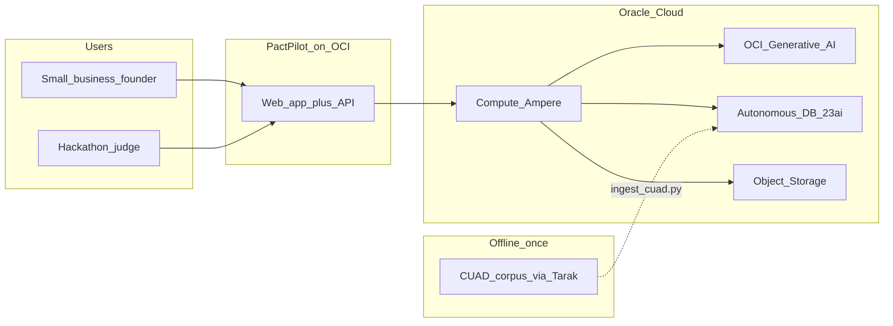

### ASCII

```
                    ┌─────────────────────────────────────┐
                    │         ORACLE CLOUD (OCI)          │
                    │  compartment: hackathon             │
  Founder/Judge ──► │  ┌──────────────┐                   │
                    │  │ Ampere VM    │──► GenAI (LLM+emb)│
                    │  │ nginx+FastAPI│──► ADB 23ai (vec) │
                    │  └──────────────┘──► Object Storage │
                    └─────────────────────────────────────┘
                              ▲
                              │ one-off ingest
                         CUAD (Tarak)
```

---

## 2. Deployment architecture (OCI-first)

**Production shape** — recommended: nginx on same Ampere VM as API ([`06-oracle-setup.md`](06-oracle-setup.md)).

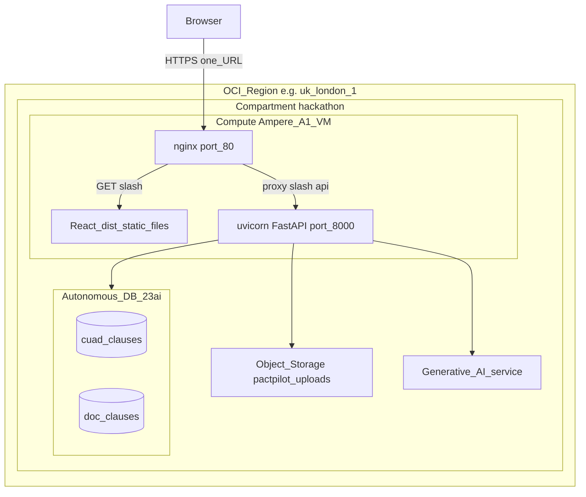

### ASCII — request routing on the VM

```
  https://demo-vm-ip/
        │
        ▼
    ┌─────────┐
    │  nginx  │
    └────┬────┘
         │
    ┌────┴────────────────────────┐
    │                             │
  GET /                      /api/*
    │                             │
    ▼                             ▼
 frontend/dist/            uvicorn :8000
 (React bundle)            (FastAPI)
```

### Hard rules

| Rule | Detail |
|------|--------|
| No third-party hosting | No Vercel, Netlify, or Lovable hosting in production |
| Lovable | Builder only; export to `frontend/`, build, serve on OCI |
| Same origin (recommended) | nginx serves UI + proxies `/api/` — `VITE_API_BASE_URL` can stay empty |

**Alternative deploy:** Object Storage static website for `dist/` + separate API URL (requires CORS / env rebuild).

---

## 3. Application containers (logical)

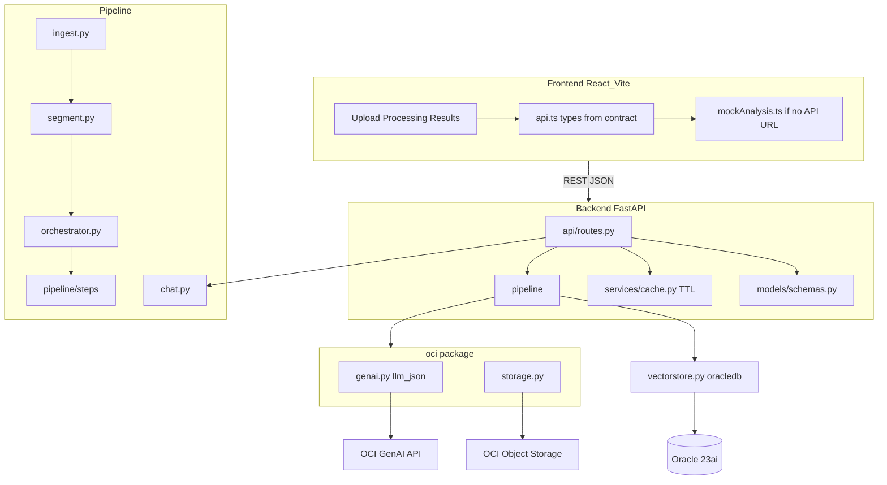

### Stack summary

| Layer | Technology |
|-------|------------|
| Frontend | React + Vite + TypeScript (Lovable), Tailwind |
| API | FastAPI, Pydantic — **no LangChain / LangGraph** |
| LLM | OCI Generative AI via raw `oci` SDK (`llm_json`) |
| Vectors | Oracle 23ai native `VECTOR` + `VECTOR_DISTANCE` via `oracledb` |
| Files | OCI Object Storage (ephemeral) |
| Session | In-memory cache keyed by `analysis_id` (~1h TTL) |

---

## 4. API surface (contract seam)

**Frozen boundary** — UI and backend only meet at [`03-api-contract.md`](03-api-contract.md).

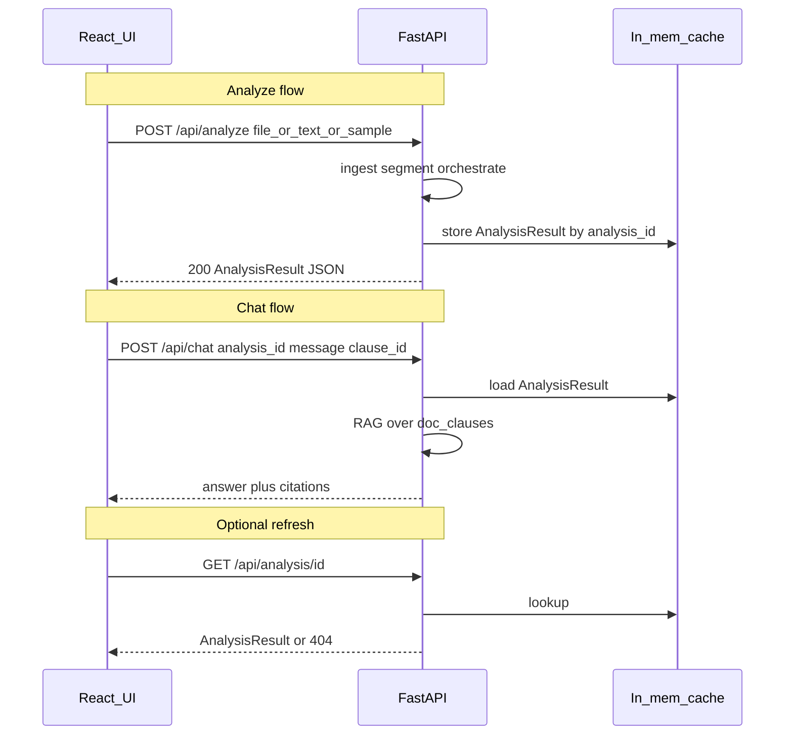

### Endpoints

| Endpoint | Method | Purpose |
|----------|--------|---------|
| `/api/samples` | GET | Landing page sample chips |
| `/api/analyze` | POST | Main analysis (sync, target &lt;40s) |
| `/api/analysis/{analysis_id}` | GET | Re-fetch cached result |
| `/api/chat` | POST | Grounded Q&A with citations |

### Integration env var

- **`VITE_API_BASE_URL`** — empty → mock mode; set → real API (unchanged components).

---

## 5. Analyze request — end-to-end sequence

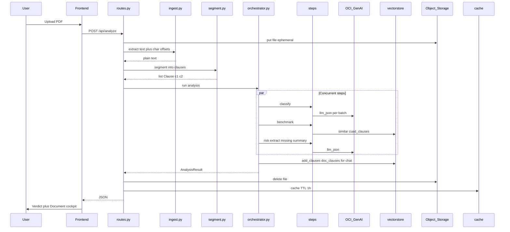

### ASCII pipeline (agentic story)

```
  PDF/DOCX
     │
     ▼
 [ ingest ] ──► full text + char offsets
     │
     ▼
 [ segment ] ──► [c1, c2, c3, ...]  ◄── fixed internal seam
     │
     ▼
 ┌──────────────── orchestrator ────────────────┐
 │  classify ──┐                                 │
 │  benchmark ─┼── asyncio.gather (parallel)     │
 │  risk ──────┤                                 │
 │  extract ───┤                                 │
 │  missing ───┤                                 │
 │  summary ───┘                                 │
 └──────────────────────────────────────────────┘
     │
     ├──► embed clauses ──► doc_clauses (for chat RAG)
     │
     ▼
 AnalysisResult JSON ──► cache[analysis_id] ──► UI
```

### Agentic steps (plain English)

`read → segment → classify → retrieve → benchmark → score → extract → summarise`

---

## 6. Analysis orchestrator (low level)

**No LangGraph** — `orchestrator.py` + `pipeline/steps/*` + `asyncio.gather`.

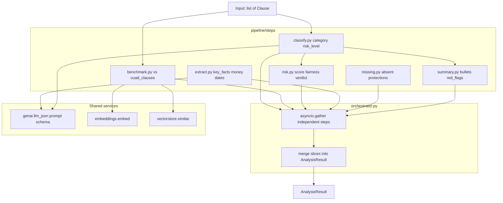

### Step → JSON mapping

| Step file | Writes to `AnalysisResult` |
|-----------|----------------------------|
| `classify.py` | `document.clauses[]` — `category`, `risk_level`, `plain_english`, … |
| `benchmark.py` | `document.clauses[].benchmark` — percentile, typical, comparison |
| `risk.py` | `verdict` — `risk_score`, `risk_level`, `fairness` |
| `extract.py` | `key_facts`, `obligations`, `money`, `dates`, `exit`, `scenarios` |
| `missing.py` | `missing_clauses` |
| `summary.py` | `verdict.summary_line`, `summary_bullets`, `red_flags` |

After orchestrator completes: embed uploaded clauses into **`doc_clauses`** for chat.

---

## 7. Chat / RAG flow

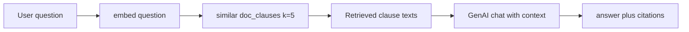

| Input | Effect |
|-------|--------|
| `analysis_id` | Required — loads cached analysis context |
| `message` | User question |
| `clause_id` (optional) | Scopes RAG to one clause (“ask about this clause”) |

**Response:** `{ answer, citations: [{ clause_id, quote }] }`

---

## 8. Data layer — vector tables

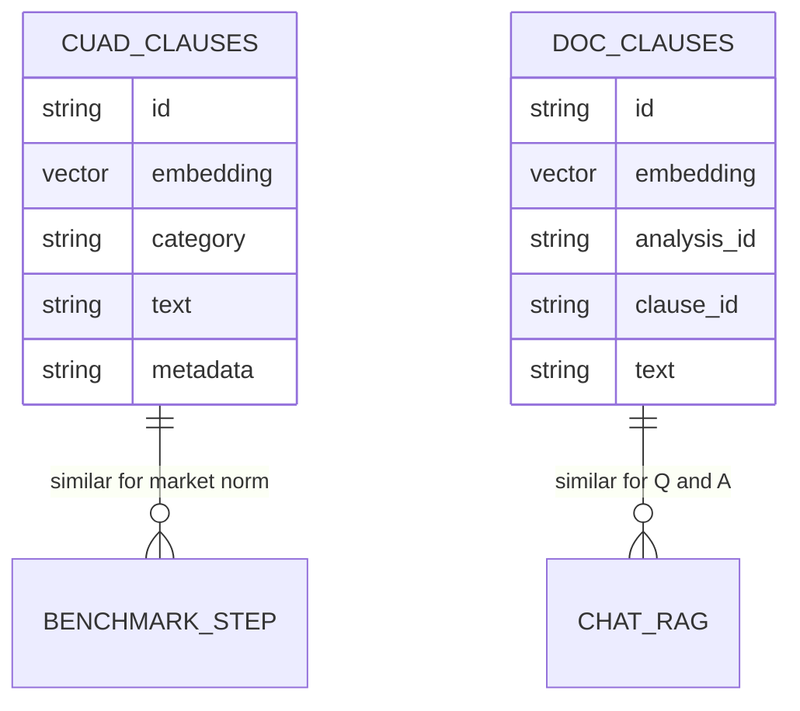

### Offline vs online

```
 OFFLINE (once: Tarak data → Mykyta runs ingest_cuad.py)
 ────────────────────────────────────────────────────────
 CUAD files ──► ingest_cuad.py ──► cuad_clauses table
                                   (market reference)

 ONLINE (every user upload)
 ─────────────────────────
 User contract ──► segment ──► orchestrator
                                    │
                                    ├── benchmark → query cuad_clauses
                                    │
                                    └── embed ──► doc_clauses
                                                      │
                                                      └── chat RAG queries here
```

### Similarity query (conceptual SQL)

```sql
SELECT id, text, category, ...
FROM cuad_clauses
ORDER BY VECTOR_DISTANCE(embedding, :query_vec, COSINE)
FETCH FIRST :k ROWS ONLY;
```

### Collection names (fixed — do not rename)

| Table | Purpose | Built when |
|-------|---------|------------|
| `cuad_clauses` | Market benchmark (CUAD corpus) | Once, offline |
| `doc_clauses` | Per-contract Q&A retrieval | Each `POST /api/analyze` |

---

## 9. Frontend information architecture

From [`04-lovable-ui-prompt.md`](04-lovable-ui-prompt.md): **single page**, warm “contract book” design.

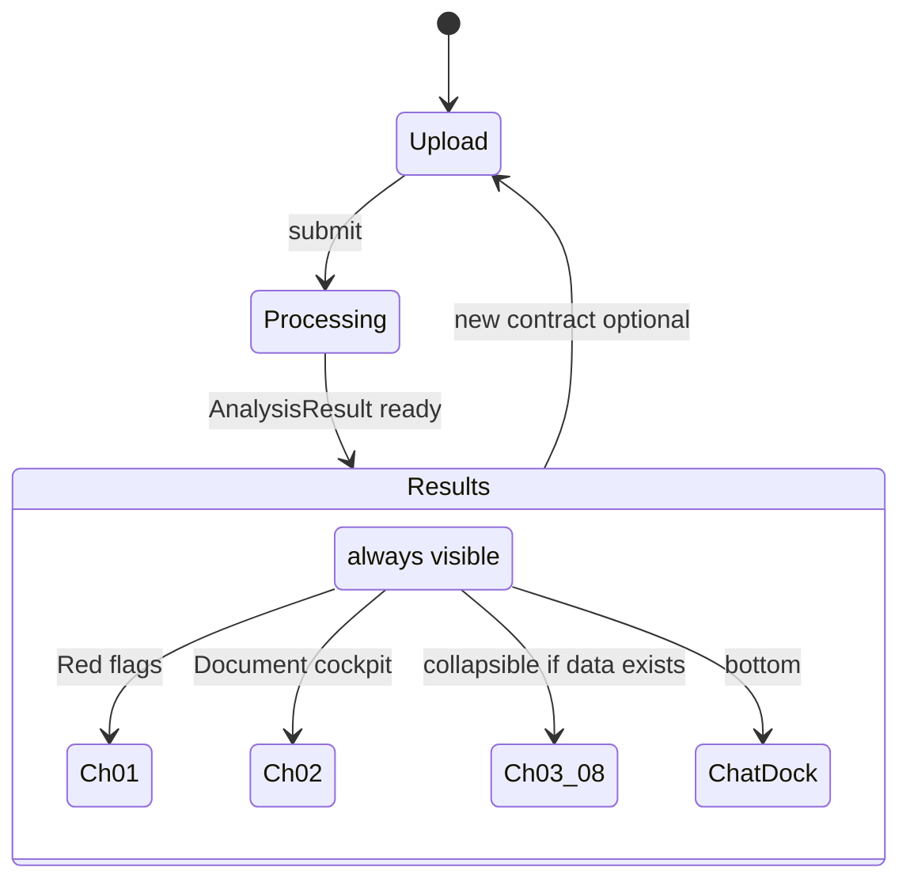

### Design tokens (summary)

| Token | Value |
|-------|--------|
| Background | `#FAF6EE` warm ivory |
| Cards | `#FFFFFF` |
| Primary | Navy `#1E3A8A` |
| Accent | Gold `#B45309` |
| Risk HIGH / MED / LOW | `#B91C1C` / `#B45309` / `#15803D` |
| Fonts | EB Garamond (serif), Lato (sans) |

### Chapter 02 — 3-pane cockpit

```
┌─────────────────────────────────────────────────────────────┐
│  Chapter 02 — The document                                  │
├──────────┬──────────────────────────────┬───────────────────┤
│  INDEX   │  DOCUMENT (document.html)    │  DETAIL           │
│  layers  │  risk highlights             │  quote            │
│  filter  │  + minimap ticks             │  plain_english    │
│  list    │  data-clause="c3"            │  benchmark        │
│          │                              │  suggested_fix    │
└──────────┴──────────────────────────────┴───────────────────┘
     ▲              ▲                              ▲
     └──────────────┴── same clause_id ────────────┘
           red flag click / chat citation
```

### Four sync points (must stay aligned)

1. Left **index** list  
2. Center **document** highlight (`data-clause`)  
3. **Minimap** ticks  
4. Right **detail** panel  

Also: red-flag prev/next and chat citation clicks must select the same `clause_id` and scroll the document.

### Collapsible chapters

| Chapter | Content | Default state |
|---------|---------|---------------|
| Verdict band | Gauge, wax seal, fairness, key facts | Always visible |
| 01 — Red flags | `red_flags[]` | Open |
| 02 — Document | `document.html` + cockpit | Open |
| 03 — Obligations | `obligations` | Collapsed if present |
| 04 — Money | `money` | Collapsed if present |
| 05 — Key dates | `dates[]` timeline | Collapsed if present |
| 06 — Exit | `exit` | Collapsed if present |
| 07 — Missing clauses | `missing_clauses` | Collapsed if present |
| 08 — Scenarios | `scenarios[]` | Collapsed if present |
| Chat dock | `/api/chat` | Bottom of page |

**Rule:** Hide entire chapter if data is `null` or `[]`.

---

## 10. Backend module map

```
backend/
├── app/
│   ├── main.py              ← FastAPI entry
│   ├── config.py            ← .env / pydantic-settings
│   ├── api/routes.py        ← 4 endpoints
│   ├── models/schemas.py    ← mirrors 03-api-contract.md
│   ├── services/cache.py    ← analysis_id → result (TTL)
│   ├── pipeline/
│   │   ├── ingest.py
│   │   ├── segment.py       ◄── fixed seam: list[Clause]
│   │   ├── embeddings.py
│   │   ├── vectorstore.py   ◄── 23ai SQL
│   │   ├── orchestrator.py
│   │   ├── chat.py
│   │   └── steps/
│   │       ├── classify.py
│   │       ├── risk.py
│   │       ├── benchmark.py
│   │       ├── extract.py
│   │       ├── missing.py
│   │       └── summary.py
│   └── oci/
│       ├── genai.py         ← GenerativeAiInferenceClient, llm_json()
│       └── storage.py
├── data/samples/            ◄── demo PDFs (Tarak)
└── scripts/ingest_cuad.py   ◄── one-off → cuad_clauses
```

### Internal seam (do not change)

```python
segment(text) -> list[Clause{id, heading, text, start, end}]
```

Char offsets `start`/`end` drive UI highlighting.

---

## 11. Team parallelization

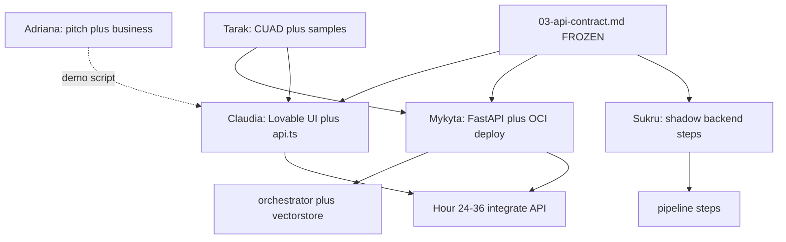

### Parallel tracks

| Track | Can start day 1? | Depends on |
|-------|------------------|------------|
| A. Lovable UI | Yes | API contract + mock JSON |
| B. Backend skeleton | Yes | API contract (canned response) |
| C. Ingestion + segmentation | Yes | Nothing |
| D. Vector store + CUAD ingest | Yes | OCI access |
| E. Analysis steps | Yes | Pydantic schemas |
| F. OCI setup + deploy | Yes | OCI account (lead) |

### Hour 0 unblock

Backend returns **hard-coded** `AnalysisResult` from `supplier_result.json` → Claudia integrates immediately.

---

## 12. Dev vs judged demo

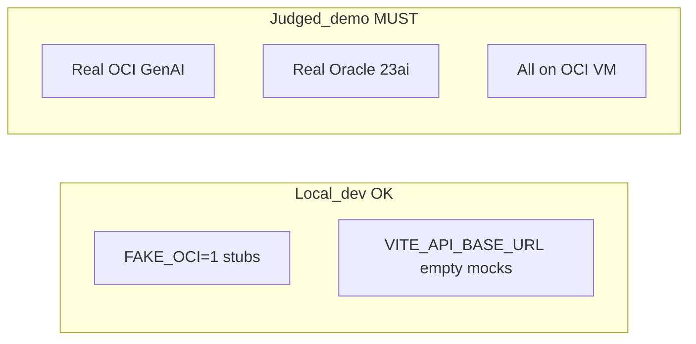

| Mode | Backend | Frontend | Vectors |
|------|---------|----------|---------|
| **Local dev** | `FAKE_OCI=1` | mock `mockAnalysis.ts` | In-memory cosine fallback OK |
| **Judged demo** | Real `oci` SDK | Static bundle on OCI nginx | Real ADB `cuad_clauses` + `doc_clauses` |

---

## 13. Product layers vs JSON

```
┌─────────────────────────────────────────────────────────┐
│  UI: Verdict band (non-collapsible)                     │
│      ← verdict, key_facts, red_flags, benchmark_summary │
├─────────────────────────────────────────────────────────┤
│  UI: Ch.01 Red flags    ← red_flags[]                   │
│  UI: Ch.02 Document    ← document.html + clauses[]      │
│  UI: Ch.03–08         ← obligations, money, dates...    │
│      (hidden if null)                                   │
├─────────────────────────────────────────────────────────┤
│  UI: Chat dock          ← POST /api/chat                │
└─────────────────────────────────────────────────────────┘
```

### Layer guarantees ([`03-api-contract.md`](03-api-contract.md))

| Layer | Fields | UI rule |
|-------|--------|---------|
| **Layer 1 (guaranteed)** | `verdict`, `key_facts`, `red_flags`, `document.clauses` | Core demo must work |
| **Layer 2 (best-effort)** | `obligations`, `money`, `dates`, `exit`, `scenarios`, `missing_clauses` | Hide section if absent |

---

## 14. Quick reference

| I need to understand… | See section |
|------------------------|-------------|
| Pitch: “everything on Oracle” | [§2](#2-deployment-architecture-oci-first), [§12](#12-dev-vs-judged-demo) |
| Claudia: UI structure & sync | [§9](#9-frontend-information-architecture) |
| Mykyta: backend wiring | [§6](#6-analysis-orchestrator-low-level), [§10](#10-backend-module-map) |
| Tarak: data handoff | [§8](#8-data-layer--vector-tables) |
| Integration / debugging | [§4](#4-api-surface-contract-seam), [§5](#5-analyze-request--end-to-end-sequence) |
| OCI mental model | [`08-oci-onboarding.md`](08-oci-onboarding.md) |
| Requirements IDs | [`00-prd.md`](00-prd.md) |

---

*Last updated to match engineering docs on `main` (FastAPI-only, OCI-first, contract-book UI).*
