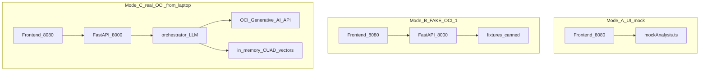
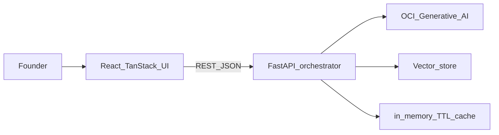
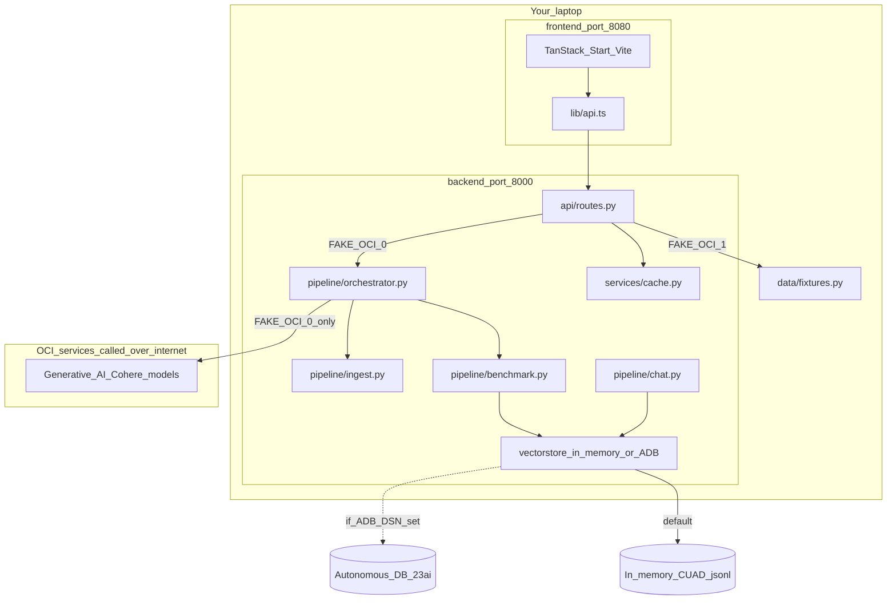
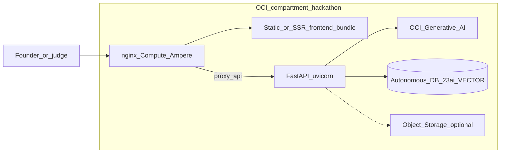
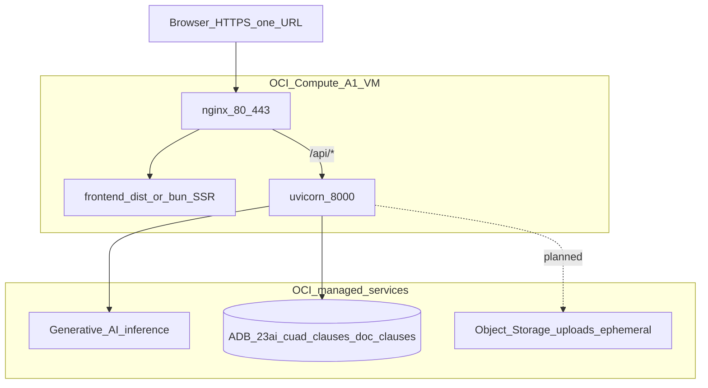

# PactPilot — Local vs Deployed Architecture

> **Purpose:** Clarify what runs today on your machine vs what judges expect on Oracle Cloud Infrastructure (OCI).  
> **Branch context:** CTO app on `main` / `test/cto-app` (TanStack UI + FastAPI).  
> **Status source:** [`docs/STATUS.md`](STATUS.md) — *“No OCI deploy yet.”*

---

## 1. Crucial question: Is this just MVP + mock data?

| Question | Answer |
|----------|--------|
| Is it deployed on OCI? | **No** — not yet. Runs on `localhost` (your PC). |
| Is it “only mock”? | **Not only.** There are **three** local modes (see §2). |
| Is the product real? | **Yes** — full UI + API + (optional) real OCI GenAI + CUAD RAG. |
| Is Oracle 23ai connected? | **Usually no locally** — in-memory vector fallback unless `ADB_DSN` is set. |
| Is Object Storage used? | **Not yet** — uploads stay in-process; OCI bucket is planned. |

**What you tested with `FAKE_OCI=1`:**  
Backend returns a **canned `AnalysisResult`** from [`backend/app/data/fixtures.py`](../backend/app/data/fixtures.py). The UI is real; the **analysis is fixed demo data**, not a live LLM call.

**What Mykyta verified (`FAKE_OCI=0` on laptop):**  
Same app, but **`/api/analyze` calls OCI Generative AI** (Cohere via SDK, e.g. `cohere.command-r-08-2024`) and uses **CUAD-backed vector RAG** in memory (~45s). Still **not** “deployed” — your laptop calls OCI APIs over the internet.

**Frontend “mock mode”:**  
If `VITE_API_BASE_URL` is **empty**, the UI never calls the backend and uses [`frontend/src/lib/mockAnalysis.ts`](../frontend/src/lib/mockAnalysis.ts).

---

## 2. Local modes (what you can run today)

| Mode | Backend `.env` | Frontend `.env` | Analysis | Vector / RAG | Hosted on OCI? |
|------|----------------|-----------------|----------|--------------|----------------|
| **A — UI mock** | (any) | `VITE_API_BASE_URL` empty | Static mock in browser | None | No |
| **B — Canned API** | `FAKE_OCI=1` | `http://localhost:8000` | Fixed fixture | Fixture data only | No |
| **C — Real AI, local host** | `FAKE_OCI=0` + `~/.oci/config` | `http://localhost:8000` | Real OCI GenAI LLM | In-memory CUAD (`cuad_clauses.jsonl`) | **No** (API calls only) |

Check: http://localhost:8000/health → `"fake_oci": true` (Mode B) or `false` (Mode C).

---

## 3. Do we need to deploy now?

| Audience | Need deploy? | Why |
|----------|--------------|-----|
| **You / team dev** | No (for now) | Mode B or C on localhost is enough to build UI and test API. |
| **Hackathon judges** | **Yes, before demo** | Brief requires **deployed** app + **OCI GenAI** + **vector DB** + **RAG**, all on OCI. |
| **Sponsor story** | **Yes** | “Everything on Oracle” = UI bundle + API on **OCI Compute**, not Vercel + laptop. |

**Recommended order (from [`docs/STATUS.md`](STATUS.md)):**

1. Local `FAKE_OCI=0` works (GenAI smoke test) — **done** ✅  
2. Connect **Autonomous DB 23ai** (`ADB_*`, run `scripts/ingest_cuad.py`) — **next** for real vector DB  
3. **Deploy** API + frontend on **OCI Compute** (nginx, one URL) — **required for judging**  
4. Optional: Object Storage for ephemeral uploads; OCI Functions (slide “ingestion pipeline”) is **aspirational**, not in repo yet  

**Empty “Vector stores” in OCI Console (Generative AI):**  
That UI is for **OCI GenAI managed vector stores**. PactPilot today uses **ADB 23ai `VECTOR` columns** via `oracledb` ([`backend/app/pipeline/vectorstore.py`](../backend/app/pipeline/vectorstore.py)). Empty console ≠ app broken; it may mean you haven’t created ADB tables yet.

---

## 4. Current product architecture (as built in repo)

### 4.1 High level — logical

**Agentic flow (real path, `FAKE_OCI=0`):**  
Upload → ingest (PDF/DOCX) → **one structured LLM call** (orchestrator) → optional vector benchmark vs CUAD → cache → UI.  
Chat: embed question → **similar** on `doc_clauses` → LLM answer + citations.

### 4.2 System design — local (today)

**Not on laptop today:** OCI Compute VM, nginx, Object Storage bucket, OCI Functions chunking.

### 4.3 Slide “ingestion pipeline” vs repo reality

Workshop slides often show:

`UI → Object Storage → OCI Functions (chunking) → Embeddings → ADB 23ai`

**Repo today (simpler, monolithic API):**

`UI → FastAPI (ingest + chunk in process) → OCI GenAI embeddings → in-memory or ADB vectors`

| Slide (target) | Current code |
|----------------|----------------|
| OCI Functions chunking | **FastAPI** `ingest.py` + orchestrator |
| Object Storage drop | **Not implemented** (file in HTTP request) |
| ADB 23ai vectors | **Supported in code**, often **in-memory** locally |

---

## 5. Expected deployed architecture (judging target)

### 5.1 High level — OCI-first

### 5.2 System design — deployed (target)

**Auth:** API signing via `~/.oci/config` on the VM (not in `.env`).  
**Models (typical):** `cohere.command-r-08-2024`, `cohere.embed-english-v3.0`.

---

## 6. Side-by-side comparison

| Dimension | Local (today) | Deployed (expected) |
|-----------|---------------|---------------------|
| **Where UI runs** | `localhost:8080` | OCI Compute (+ nginx) |
| **Where API runs** | `localhost:8000` | Same VM, proxied `/api/` |
| **FAKE_OCI=1** | Canned demo | **Off** in production |
| **GenAI** | Optional API calls from laptop | **Required** from VM |
| **Document AI OCR** | Optional (scanned PDFs) | **Recommended** on VM |
| **Vector DB** | In-memory CUAD (default) | **ADB 23ai** (judge requirement) |
| **CUAD corpus** | `cuad_clauses.jsonl` in repo | Ingested into ADB (`ingest_cuad.py`) |
| **Uploads** | Multipart to API | Same + optional Object Storage |
| **Public URL** | None | **Required** for demo |
| **OCI Console “Vector stores”** | N/A | May stay empty; app uses **ADB VECTOR** |

---

## 7. Hackathon capability checklist

| Requirement | Local Mode B | Local Mode C | Deployed target |
|-------------|--------------|--------------|-----------------|
| Working prototype | ✅ | ✅ | ✅ |
| RAG | ❌ (canned) | ✅ (in-mem) | ✅ (ADB) |
| OCI AI service | ❌ | ✅ (calls) | ✅ |
| Vector database | ❌ / fake | ⚠️ in-mem | ✅ 23ai |
| **Deployed app** | ❌ | ❌ | ✅ **must do** |

---

## 8. What to do next (practical)

1. **Confirm mode:** `GET /health` → `fake_oci: false` for real AI.  
2. **For judging:** Mykyta (or lead) follows [`docs/06-oracle-setup.md`](06-oracle-setup.md): VM + wallet + `FAKE_OCI=0` + nginx.  
3. **Vector DB:** Set `ADB_*`, run `python -m scripts.ingest_cuad` — satisfies “real” vector DB vs slides-only.  
4. **Pitch:** Local demo is fine for dev; **live demo URL must be OCI** for sponsors.  
5. **Real contract (e.g. rental lease):** Upload PDF/DOCX locally with `FAKE_OCI=0` — no deploy required.

---

## 9. Related docs

| Doc | Topic |
|-----|--------|
| [`README.md`](../README.md) | Product + quick start |
| [`docs/STATUS.md`](STATUS.md) | What’s done / not deployed |
| [`backend/README.md`](../backend/README.md) | FAKE_OCI, endpoints, `.env` |
| [`frontend/README.md`](../frontend/README.md) | Mock vs API URL |
| [`docs/06-oracle-setup.md`](06-oracle-setup.md) | Deploy checklist |
| [`docs/08-oci-onboarding.md`](08-oci-onboarding.md) | OCI mentoring guide |
| [`docs/09-architecture-diagrams.md`](09-architecture-diagrams.md) | Earlier diagrams |
| [`docs/00-prd.md`](00-prd.md) | Requirements + constraints |

---

*OCI workshop slides (ingestion pipeline, GenAI models, ADB vector search) describe the **platform story**; this doc maps them to **what the repo actually does today**.*
